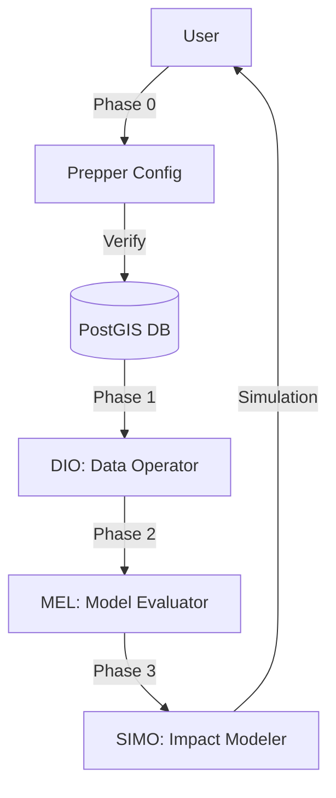

# SLR Multi-Agent MCP Pipeline (v2)

A sophisticated four-agent pipeline for sea level rise flood damage modeling, built on a **Model Context Protocol (MCP)** architecture. 

The primary interface is the **Next.js Orchestration Hub** (`hub/`)—a professional control plane that manages the full workflow (Phase 0 → 3) from a unified, academic-style dashboard. The system coordinates three specialized AI agents (DIO, MEL, SIMO) and a deterministic configuration wizard (Prepper) through a high-fidelity workspace.



---

## Architecture

| Component | Role | Tech Stack |
|-------|------|------|
| **Next.js Hub** | **Primary Control Plane** — Central orchestration & workspace | Next.js, Tailwind, Zustand, React Flow |
| **Prepper** | Setup wizard — verifies DB & LLM credentials | Deterministic React UI |
| **DIO** | Data Operator — PostGIS discovery, spatial clipping | Python, FastAPI, PostGIS |
| **MEL** | Model Evaluator — Ensemble learning, R² / RMSE metrics | Python, Scikit-learn, XGBoost |
| **SIMO** | Impact Modeler — Flood simulation, MVT tiles, RAG chat | Python, Leaflet, ChromaDB |

---

## Simulator Workspace

The Hub provides a split-screen **Simulator Workspace**:

| Panel | Content |
|-------|---------|
| **Left — Orchestrator** | Persistent AI chat interface for multi-agent coordination. |
| **Right — Agent Canvas** | Dynamic, agent-specific interactive views: **Leaflet Map** with PostGIS Browser (DIO), **Analytics Dashboard** (MEL), and **Scenario Sliders** (SIMO). |

---

---

## Quick Start

### Prerequisites

- Node.js 18+ and npm
- Docker Desktop
- Access to the Azure PostgreSQL database
- Python 3.10+

### 1. Configure environment

```bash
cp .env.example .env
# Fill in PGPASSWORD and LM_STUDIO_URL
```

### 2. Start MCP Agents (Backend)

The backend agents (DIO, MEL, SIMO) are containerized:

```bash
docker compose up --build
```

### 3. Launch the Next.js Orchestration Hub

The Hub is the primary control plane for the pipeline:

```bash
cd hub
npm install
npm run dev
# Open http://localhost:3000
```

### 4. Verification

1.  Enter your database credentials in the **Phase 0 (Prepper)** screen.
2.  Click **Verify Connection**.
3.  Once verified, click **Launch SLR Simulator**.

---

## Directory Structure

```
slr-pipeline/
├── hub/                      # Primary Control Plane (Next.js + Tailwind)
│   ├── src/app/              # App Router (Prepper, Simulator)
│   ├── src/components/       # Hub components (Leaflet, React Flow, Recharts)
│   └── src/store/            # Zustand global state (Credentials, Layers)
├── agents/                   # Python MCP Microservices
│   ├── prepper/              # Agent 0: setup wizard (Legacy/Config)
│   ├── dio/                  # Agent 1: Data Operator + PostGIS tools
│   ├── mel/                  # Agent 2: Model Evaluator + Ensemble learning
│   └── simo/                 # Agent 3: Impact Modeler + Simulation engine
├── shared/                   # Shared DB and schema utilities
├── scripts/                  # DB initialization and Azure VM scripts
└── daily_log/                # Detailed session logs
```

---

## Blog & Updates

For a high-level introduction to the project goals and architecture, check out our [Project Introduction Blog](file:///Users/jorgecorcino/.gemini/antigravity/brain/1b75c615-38db-4840-a289-ede299d7d6c9/blog_intro.md).

---

## Audit & Compliance

Every orchestration action and tool call is logged to the `agent_audit_log` table for full observability and compliance.
